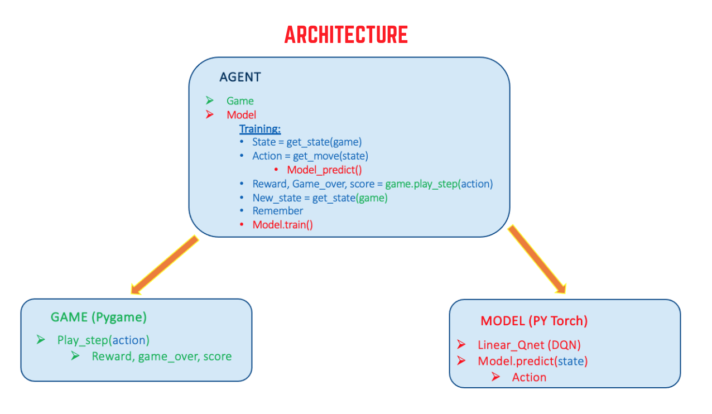

## @Author : Rupesh Kumar
Date : 07/02/2023
Licensed Under the [MIT License](LICENSE.md)

# Deep Reinforcement Learning
## Project: Train AI Vs Ennemi

## Introduction
The goal of this project is to develop an AI able to learn how to capture its emmemi. In order to do it, I implemented a Deep Reinforcement Learning algorithm. This approach consists in giving the system parameters related to its state, and a positive or negative reward based on its actions. No rules about the game are given, and initially the AI agent has no information on what it needs to do. The goal for the system is to figure it out and elaborate a strategy to maximize the score - or the reward. \
We are going to see how a Deep Q-Learning algorithm learns how to capture ennemi.

## Install
This project requires Python 3.6 with the pygame library installed, as well as Pytorch. If you encounter any error with `torch=1.7.1`, you might need to install Visual C++ 2015-2019 (or simply downgrade your pytorch version, it should be fine). \
The full list of requirements is in `requirements.txt`. 

## Run
To run and show the game, executes in the snake-ga folder:

```python
python snakeClass.py
```
Arguments description:

- --display - Type bool, default True, display or not game view
- --speed - Type integer, default 50, game speed

The default configuration loads the file *weights/weights.h5* and runs a test.

To train the agent, set in the file snakeClass.py:
- `params['train'] = True`
The parameters of the Deep neural network can be changed in *snakeClass.py* by modifying the dictionary `params` in the function `define_parameters()`

If you run snakeClass.py from the command line, you can set the arguments `--display=False` and `--speed=0`. This way, the game display is not shown and the training phase is faster.


### **ARCHITECTURE OF APPLICATION**

<p align="center">
  
</p>
