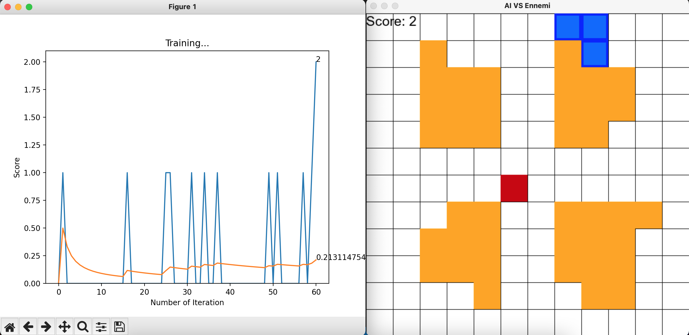

## @Author : Rupesh Kumar
Date : 07/02/2023
Licensed Under the [MIT License](LICENSE.md)

# Deep Reinforcement Learning
## Project: Train AI Vs Ennemi

### INTRODUCTION
The goal of this project is to develop an AI able to learn how to capture its emmemi in an environment custom build with obstacles. In order to do it, I implemented a Deep Reinforcement Learning algorithm. This approach consists in giving the system parameters related to its state, and a positive or negative reward based on its actions. No rules about the game are given, and initially the AI agent has no information on what it needs to do. The goal for the system is to figure it out and elaborate a strategy to maximize the score - or the reward.

We are going to see how a Deep Q-Learning algorithm learns how to capture ennemi.

### INSTALL
This project requires Python 3.8.5 with the pygame library installed, as well as Pytorch. 

The full list of requirements is in `requirements.txt`. 

**Note: Please make sure you have updated you`pip` version.**

### RUN
To run and train the AI:

```python
python agent.py
```

Arguments description:

- --MAX_MEMORY - Maximum number of experiences to store in memory
- --BATCH_SIZE - Size of the mini-batch used for training.
- --LR - Learning rate for the neural network optimizer.


### ARCHITECTURE OF APPLICATION

<p align="center">
  
</p>

## RESULTS

- After running the model for 5 minutes an average score of 1.5 points was reaching considering the highly limited environment of 12*12 matrices.

<p align="center">
  
</p>

## RECOMMENDATION

- **Matrix Size Expansion:**

Increase the matrix size from 12x12 to a larger dimension (e.g., 20x20 or 30x30) to provide the model with a more challenging and realistic environment.

- **Extended Training:**

Extend the training duration to allow the model to adapt and learn optimal strategies in the larger environment fully.

- **Hyperparameter Tuning:**

Fine-tune hyperparameters such as learning rate, discount factor, and network architecture to optimize performance in the expanded matrix.

- **Visualization and Analysis:**

Visualize training progress and analyze performance metrics to identify areas for improvement and track progress effectively.

- **Ensemble Learning:**

Explore ensemble learning techniques to leverage multiple models' predictions and improve overall performance and robustness.
